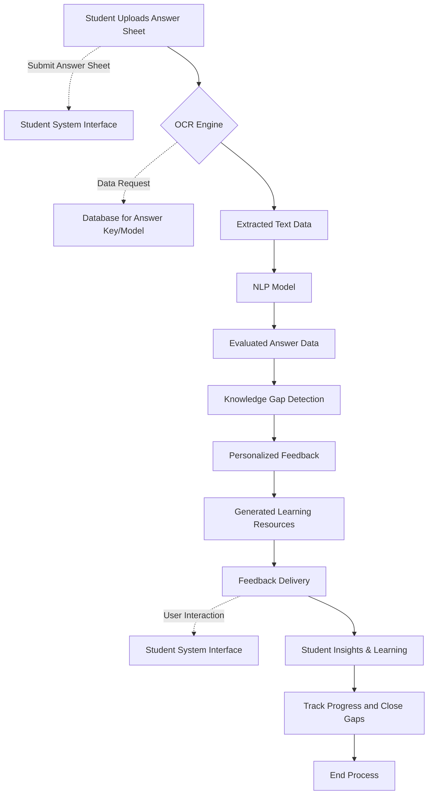
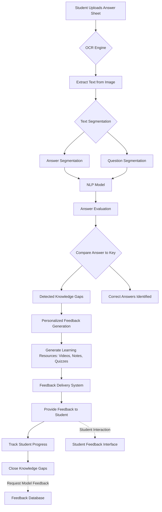

Here is the **Data Flow Diagram (DFD)** for your system. I'll provide both **Level-1** and **Level-2** DFDs to break down how data flows through the entire process.

---

### **Level-1 DFD**
This diagram provides an overview of the main components of the system and how data flows between them.

### **Explanation of Level-1**:
- **Student Uploads Answer Sheet**: The student submits their handwritten answer sheet.
- **OCR Engine**: The system uses OCR to extract the text from the image.
- **NLP Model**: The system processes the extracted text and compares it to the answer key or model.
- **Knowledge Gap Detection**: Areas where the student struggled are detected.
- **Personalized Feedback & Learning Resources**: Feedback is generated, and learning resources (videos, quizzes) are created.
- **Feedback Delivery**: The feedback and resources are provided to the student.
- **Tracking Progress**: Student progress is tracked for continuous improvement.

### **Level-2 DFD**
This diagram breaks down the internal processes into more detail.

### **Explanation of Level-2**:
1. **OCR Engine**: Extracts text from the image, which is further segmented into individual answers and questions.
2. **NLP Model**: Processes each answer using natural language processing techniques to evaluate its correctness.
3. **Answer Evaluation**: Compares answers against the key, detects knowledge gaps, and identifies correct answers.
4. **Feedback Generation**: Uses detected gaps to create personalized feedback and generate relevant learning resources like videos, notes, and quizzes.
5. **Feedback Delivery**: Delivers personalized feedback and learning resources to the student via an interface.
6. **Progress Tracking**: Tracks the student’s progress and suggests further resources if required.

In this diagram, **data flows between modules** (like OCR, NLP, Feedback Generation) and the **system interfaces** (for interaction with students), while feedback and progress are stored in a **database** for further tracking.

---

### Visual Representation Using Flowchart:

### Key Features:
- **Modules**: OCR, NLP, Answer Evaluation, Knowledge Gap Detection, Feedback Generation, and Delivery.
- **External Interfaces**: Student system interface for submission and interaction, database for feedback tracking.

These DFDs will help visually communicate how data moves through the system and the relationships between different components.